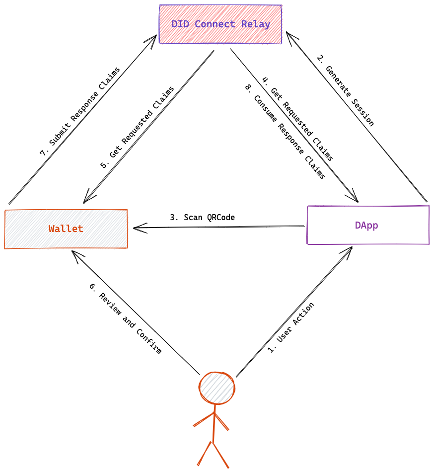

### 术语表

我们可以把完整的 DID Connect 过程称为 `DID Connect 会话`，会话过程中的参与方包括：

- `User(Agent)`: 通常指支持 DID Connect 协议的数字钱包，可帮助管理用户的数字身份和数字资产，比如 [DID Wallet](https://didwallet.io/)
- `DApp`: 可以是任何类型的去中心化应用，DID Connect 会话中的应用通常需要用户提供某些信息以完成特定业务流程，在 ArcBlock 生态中，应用通常用 [Blocklet](https://blocklet.io) 代称。
- `Relay`: 在 DID Connect 过程中维护会话的状态、中转并校验应用的请求和用户的响应，Relay 通常会寄生在某个 Web Server 中并且依赖某个底层的存储来保存会话状态
- `Requested Claims`：应用根据协议组装并发送给用户的用于描述需要用户做什么的数据片段，可以单次发送多个请求
- `Response Claims`：用户在审查应用的请求并同意之后，由钱包组装并提交给应用的数据片段

### 流程图解

完整的 `DID Connect 会话` 流程如下图所示：

每个步骤解释如下：

1. 用户和应用交互时需要提供数字身份、数据签名、交易签名、可验证声明、资产所有权证明、通行证等数据
2. 应用生成 DID Connect 会话，并将会话保存到 Relay 中，获得会话的 deepLink
3. 应用将 deepLink 二维码呈现给用户，用户用钱包扫码
4. 应用在钱包扫码后用标准格式将需要用户提供的信息（Requested Claims）保存到 Relay 中
5. 钱包拿到应用的 Requested Claims，解析并呈现给用户
6. 用户在钱包审查并同意
7. 钱包把响应（Response Claims）提交给 Relay，通过 Relay 的校验之后被保存到会话中
8. 应用通过订阅或者轮询的方式拿到钱包的响应，继续后面的业务流程

关于上述流程的额外说明：

- 步骤 4 合并和步骤 2 是分开的，以满足应用在某些情况下知道用户身份之后才能精确确定需要用户提供的信息，比如必须提供某个账户下面的通行证
- 步骤 6 中用户可以在钱包中选择拒绝，拒绝时应用也会收到通知，并可执行相应的回调
- 步骤 7 中如果当前会话分多个步骤，则会回到第 5 步直到所有的的步骤都完成
- 为了良好的用户体验，DID Connect 会话过程中的大部分等待都设置了超时

此外，步骤 4 和 步骤 8 可能并不是发生在浏览器中，主要是因为某些计算无法在浏览器端完成，某些计算比较敏感不适合在浏览器完成：

- 应用可以在会话创建的时候提供一个 API，Relay 在钱包扫码时请求该 API 获取 Requested Claims
- 应用可以在会话创建的时候提供一个 API，Relay 在钱包提交 Response Claims 时转发请求到这里

这种情况下，整个流程就变成下图：

### 状态机视角

> 如果你不是开发者，可以安全的跳过这个部分。

因为整个 DID Connect 流程涉及钱包、应用、用户以及可能的远程 API，状态变化流程和分支比较复杂，用状态机来描述 `DID Connect 会话`的完整过程再合适不过了：

<iframe
  src="https://stately.ai/viz/embed/98beeb99-5b56-4c3f-9743-3250bac3ec50?mode=viz&panel=code&showOriginalLink=1&readOnly=1&pan=0&zoom=1&controls=1"
  sandbox="allow-same-origin allow-scripts"
  width="100%"
  height="480"></iframe>

> 如果你想更好的查看并和 DID Connect 状态机交互，可以猛击[这里](https://stately.ai/viz/98beeb99-5b56-4c3f-9743-3250bac3ec50)

正常情况下，成功的 `DID Connect 会话` 的完整状态变化顺序为：

- start：会话开始
- loading：表示正在创建或者加载会话
- created：已经创建成功，等待扫码
- walletScanned：钱包已经扫码
- walletConnected：钱包已经选择了当前会话使用的身份
- appConnected：应用已经确定当前会话需要的 Requested Claims
- walletApproved：钱包已经审查并提交 Response Claims
- appApproved：应用已经消费 Response Claims 并给出响应
- completed：会话完成

除了这些正常流程外，DID Connect 会话还可能会出现一些异常状态：

- rejected：用户在钱包中拒绝了当前操作
- error：任何环节发生的错误都会导致会话终止
- timeout：等待钱包、应用完成某个动作超时了
- canceled：用户在浏览器中取消了操作
