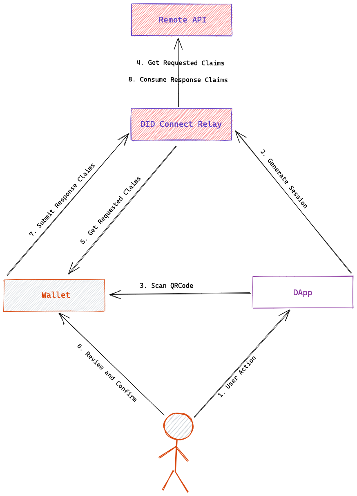

### Glossary

We can refer to the complete DID Connect process as a `DID Connect session`, and the parties involved in the session include

- `User(Agent)`: usually refers to a digital wallet that supports the DID Connect protocol and can help manage a user's digital identity and digital assets, such as [DID Wallet](https://didwallet.io/)
- `DApp`: can be any type of decentralized application, applications in a DID Connect session usually require certain information from the user to complete a specific business process, in the ArcBlock ecosystem, applications are usually referred to by [Blocklet](https://blocklet.io).
- `Relay`: Maintains the state of the session during the DID Connect process, relaying and verifying application requests and user responses, Relay is usually hosted in a Web Server and relies on some underlying storage to hold the session state
- `Requested Claims`: data pieces that the application assembles and sends to the user to describe what it needs the user to do according to the protocol, multiple requests can be sent at once
- `Response Claims`: data pieces assembled and submitted to the application by the wallet after the user has reviewed the application's request and agreed to it

### Flow diagram

The complete `DID Connect session` flow is illustrated in the following diagram.

Each step is explained as follows.

1. the user interacts with the application by providing data such as digital identity, data signature, transaction signature, verifiable statement, proof of asset ownership, pass, etc.
2. the application generates a DID Connect session and saves the session in Relay to obtain the deepLink of the session
3. the application presents the deepLink QR code to the user, and the user sweeps the code with his wallet
4. the application saves the information required from the user (Requested Claims) to Relay in a standard format after the wallet sweeps the code
5. the wallet gets the Requested Claims from the application, parses them and presents them to the user
6. The user reviews and agrees with the wallet
7. The wallet submits the response (Response Claims) to Relay, which is verified by Relay and saved in the session
8. the application gets the wallet's response by subscription or polling and continues the business process

Additional notes on the above process.

- Step 4 is merged separately from Step 2 to allow the application to know the identity of the user in some cases before it can determine exactly what information it needs from the user, for example, if it has to provide a pass under an account
- In Step 6, the user can choose to reject in the wallet, and the application will be notified of the rejection and can execute the corresponding callback.
- In step 7, if the current session is divided into multiple steps, it will go back to step 5 until all steps are completed.
- For a good user experience, most of the waits during a DID Connect session are set to timeout

In addition, steps 4 and 8 may not occur in the browser, mainly because some calculations cannot be done in the browser and some calculations are sensitive and not suitable for the browser.

- The application can provide an API at session creation time, which Relay requests to get Requested Claims when the wallet is swept
- The application can provide an API at session creation time, and Relay forwards the request here when the wallet submits Response Claims

In this case, the entire process becomes the following diagram.

### State machine perspective

> If you are not a developer, you can safely skip this part.

Because the entire DID Connect process involves the wallet, the application, the user, and possibly the remote API, the state change flow and branching is complex, and the complete process of a `DID Connect session` is best described by a state machine: the

<iframe
  src="https://stately.ai/viz/embed/98beeb99-5b56-4c3f-9743-3250bac3ec50?mode=viz&panel=code&showOriginalLink=1&readOnly=1&pan=0& zoom=1&controls=1"
  sandbox="allow-same-origin allow-scripts"
  width="100%"
  height="480"></iframe>

> If you want to better view and interact with the DID Connect state machine, you can pound [here](https://stately.ai/viz/98beeb99-5b56-4c3f-9743-3250bac3ec50)

Under normal circumstances, the complete sequence of state changes for a successful `DID Connect session` is

- start: session started
- loading: means the session is being created or loaded
- created: the session has been created successfully and is waiting to be scanned
- walletScanned: the wallet has been scanned
- walletConnected: the wallet has selected the identity to use for the current session
- appConnected: the application has determined the Requested Claims required for the current session
- walletApproved: The wallet has reviewed and submitted Response Claims
- appApproved: The application has consumed the Response Claims and given a response
- completed: The session is complete

In addition to these normal processes, a DID Connect session may have a number of exception states.

- rejected: The user has rejected the current operation in the wallet
- error: An error in any part of the process will cause the session to be terminated
- timeout: Waiting for the wallet or application to complete an action has timed out
- canceled: the user cancelled the operation in the browser
